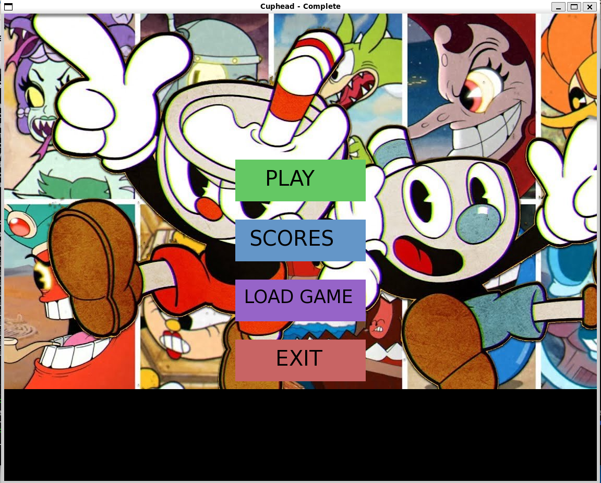
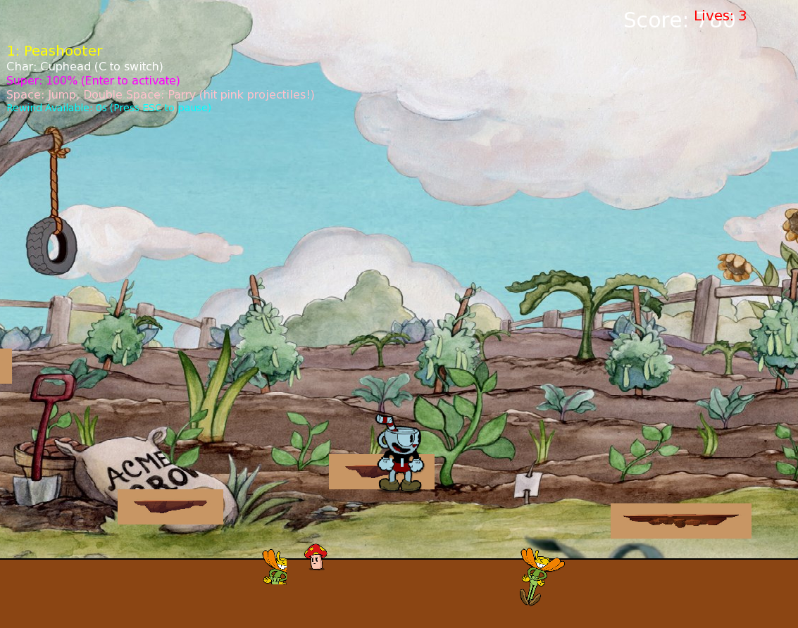
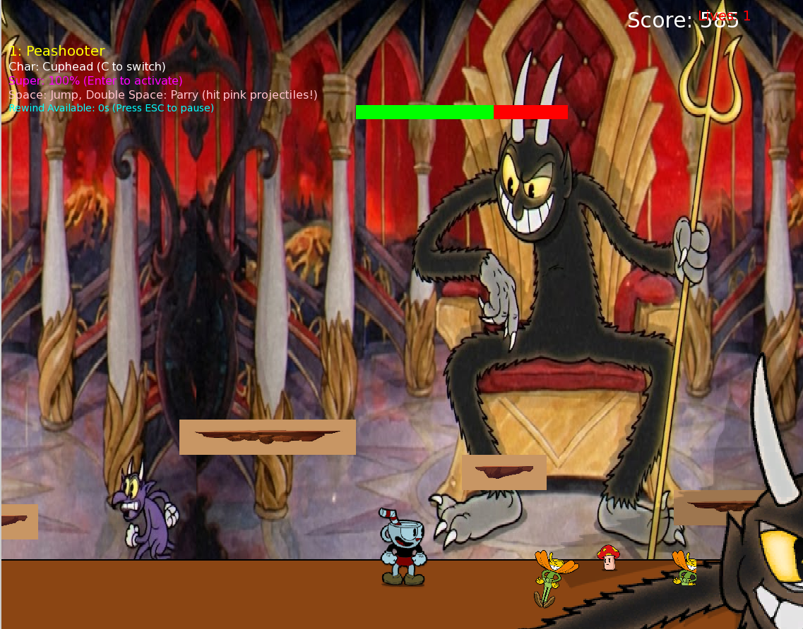
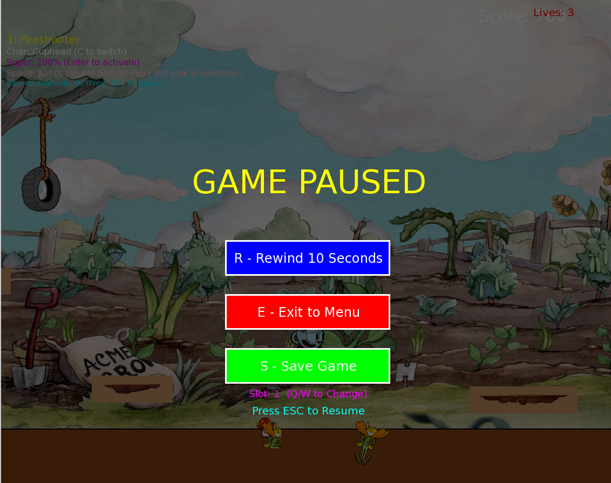
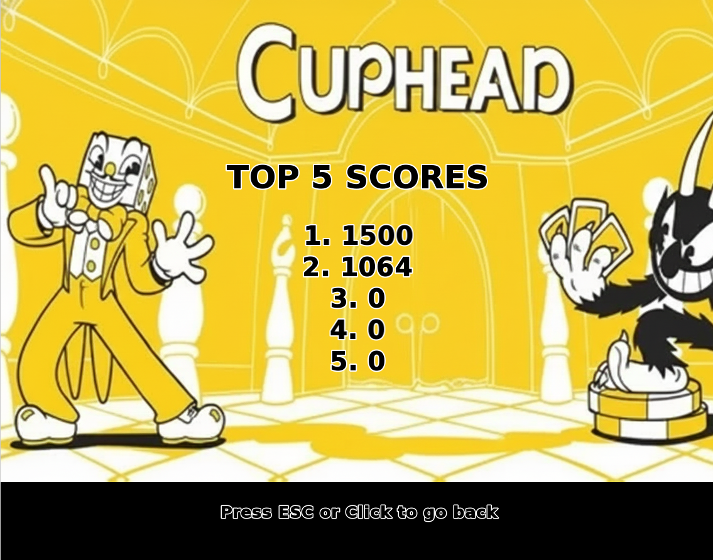

# Cuphead OOP Project

A Cuphead-inspired 2D platformer developed in **C++ using SFML** as part of the **Object-Oriented Programming** course at **FAST NUCES Islamabad**.

This project recreates key gameplay elements from Cuphead, including run-and-gun combat, enemy AI, boss battles, weapon systems, save/load functionality, and advanced game mechanics such as a rewind system. The project was developed collaboratively by a two-person team using object-oriented design principles and modular software architecture.

---

## Features

### Gameplay Systems

* Forest Follies Level
* Devil Boss Battle
* Multiple Enemy Types
* Health and Lives System
* Score Tracking
* Collision Detection
* Player Progression

### Weapons

* Charge Shot
* Roundabout Weapon
* Projectile-Based Combat

### Advanced Mechanics

* Save and Resume Functionality
* Pause System
* 10-Second Rewind Feature
* Camera Management
* Game State Management

### Boss Battle

* Multi-Phase Devil Boss
* Unique Attack Patterns
* Progressive Difficulty

---

## Object-Oriented Concepts Implemented

* Encapsulation
* Inheritance
* Polymorphism
* Abstraction
* Class-Based Architecture
* Modular Design

---

## Technologies Used

* C++
* SFML (Simple and Fast Multimedia Library)
* Object-Oriented Programming
* File Handling
* Event-Driven Programming

---

## Project Demonstration

🎥 A gameplay demonstration and project showcase can be viewed here:

**Video Demonstration:**
[(https://www.linkedin.com/posts/muhammad-dawood-a1bb40324_excited-to-share-another-university-project-ugcPost-7472992671301689345-YT3d/?utm_source=share&utm_medium=member_desktop&rcm=ACoAAFIJzbcBieJ-zMHfKZuyZR2F1OKolg5Yk8k)]

The demonstration showcases:

* Main Menu
* Forest Follies Gameplay
* Enemy Encounters
* Weapon Systems
* Boss Battle
* Save/Load Functionality
* Rewind Mechanic
* Score Tracking

---

## Screenshots

### Main Menu

### Forest Follies Gameplay

### Boss Battle

### Pause Screen

### Scoreboard

Checkout the screenshots folder, to see more visuals of the game.

---

## Learning Outcomes

Through this project, we gained practical experience in:

* Designing large-scale C++ applications
* Implementing object-oriented software architectures
* Managing game states and player interactions
* Developing enemy AI and boss mechanics
* Implementing save/load systems
* Building custom gameplay mechanics
* Debugging and optimizing interactive applications

---

## Contributors

* Muhammad Dawood
* Abdullah

---

## Future Improvements

* Additional Levels
* More Boss Battles
* Enhanced Visual Effects
* Improved Animations
* Additional Weapons
* Expanded Enemy Variety

---

## Author

Muhammad Dawood
Muhammad Abdullah Kewan
BS Cyber Security
FAST NUCES Islamabad

GitHub: https://github.com/Dawood3838
